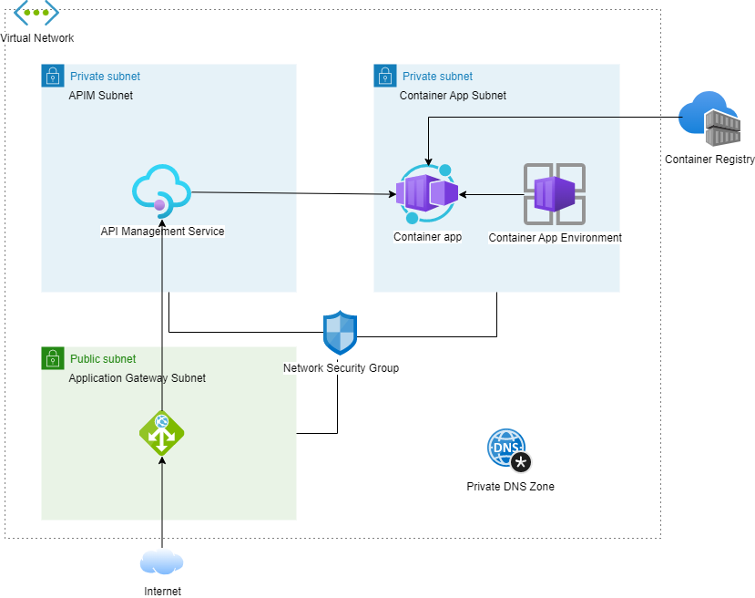

# Azure Container App connected to VNET behind App Gateway and APIM 

This folder contains a sample azure [container app](https://azure.microsoft.com/en-au/products/container-apps/). The container app is located within a VNET and it's placed behind a [APIM](https://azure.microsoft.com/en-us/products/api-management/) and [Application Gateway](https://learn.microsoft.com/en-us/azure/application-gateway/overview).

The hosted application is a simple .NET Web API with a single endpoint. 

## Architecture

The design is as below.


## Setting up
### Generating the certificate chain

Since this setup uses a private dns zone, first we need to generate certificate chain in order to communicate between application gateway, API Management service and the container application. The certificate common name should match the private DNS name. In this instance we use the DNS name as `vnet.internal`. Because of this we generate a root certificate with common name `internal`, a wildcard certificate with a common name `*.vnet.internal`. 

Pre generated certificates are located in `\bicep\certs` folder. All passwords for these certificates are set to `1234`
  
  * First create the root certificate. For this certificate the common name is used as `internal` for this exercise. 

    ```
    #1. First generate the root key.
    .\openssl.exe genrsa -des3 -out root-ca.key 4096
    #2. Create and self sign the root certificate. When prompted enter common name as "internal".
    .\openssl.exe req -x509 -new -nodes -key .\root-ca.key -sha256 -days 1024 -out .\root-cert.crt
    #3. Create a PFX file
    .\openssl.exe pkcs12 -export -out .\root-cert.pfx -inkey .\root-ca.key -in .\root-cert.crt
    ```
  * Second step is to create the signing request and generate the wild card certificate. For this step, the common name is used as `*.vnet.internal`.
    ```
    #1. Create the certificate request. Use the common name as "*.vnet.internal".
    .\openssl.exe req -new -key .\root-ca.key -out .\vnet-internal-cert.csr
    #2. Generate the certificate using the root certificate.
    .\openssl.exe x509 -req -in .\vnet-internal-cert.csr -CA .\root-cert.crt -CAkey .\root-ca.key -CAcreateserial -out .\vnet-internal-cert.crt -days 500 -sha256
    #3. Export the wildcard certificate.
    .\openssl.exe pkcs12 -export -out .\vnet-internal-cert.pfx -inkey .\root-ca.key -in .\vnet-internal-cert.crt
    ```

### Deploy infrastructure
Ideally, the infrastructure deployment should use a CD pipeline. However in this instance we would use manual deployment to simplify the code.
* Create a new resource group.
* First, generate the ARM template from the `prerequisites.bicep` file with,
  ```
  az bicep build --file .\prerequisites.bicep
  ```
* Use a new "Template Deployment" to deploy the resulting ARM template (`prerequisites.JSON`) to the resource group.
* Once the deployment is completed, modify the key vault permissions to enable writing and add following secrets to the key vault.
  * upload the root-cert.pfx with the key 'root-cert'.
  * upload the vnet-internal-cert.pfx certificate with the key 'vnet-internal-cert'.
* Generate the ARM template from the `infra.bicep`.
  ```
  az bicep build --file .\infra.bicep
  ```
* Use a new "Template Deployment" to deploy the resulting ARM template (`infra.JSON`) to the resource group.

### Deploy the application
In this example we use the podman to build and push the containers to the container registry.
* First open the wsl, navigate to the folder `\app\ping-app` and use the following command to build the docker image
  ```
  podman build . -t ping-app
  ```
* Obtain the password to the container registry and use following command to push the docker image to the registry.
  ```
  podman push ping-app:latest  <container registry name>.azurecr.io/ping-app:latest --creds=<container registry name>:<registry password>  
  ```  
* Generate the ARM template from the `ping-app.bicep` using,
  ```
  az bicep build --file .\ping-app.bicep
  ```
* Use a new "Template Deployment" to deploy the resulting ARM template (`ping-app.JSON`) to the resource group.

### Testing the application
* Obtain the public IP of the application gateway.
* Open a browser and navigate to the following address `http://<application gateway ip address>/ping-app/ping`


   
